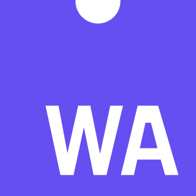
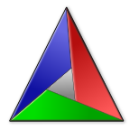
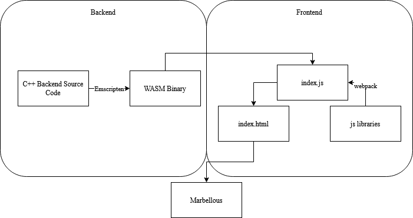
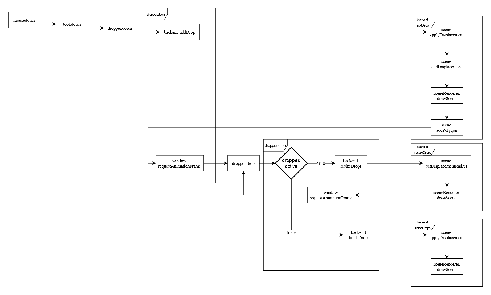
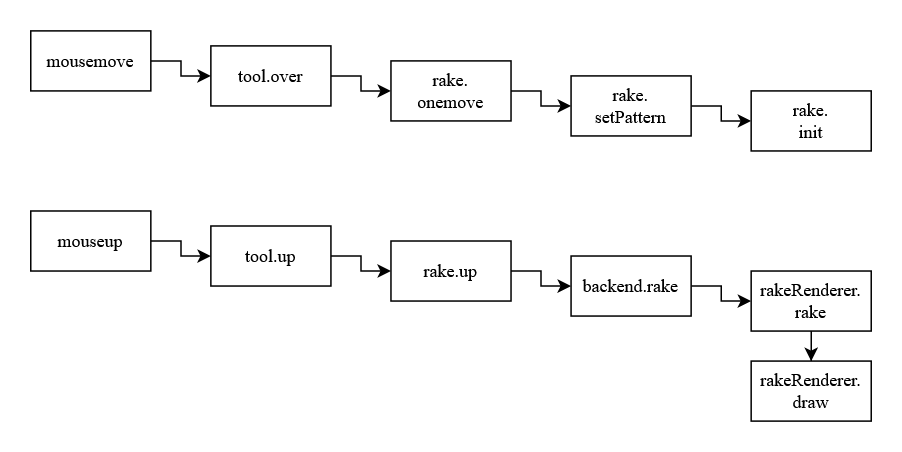

# General Documentation {#mainpage}

## Used technologies and languages

### JavaScript

<table style="border:none;border-spacing:1em"><tr><td style="width:184px">

</td><td style="width:750px">
JavaScript is a programming language originally designed to be executed
client-side in web browsers to extend the capabilities of the World Wide
Web. The source code of Marbellous is made up of about 40% JavaScript,
handling the frontend alongside HTML5 and CSS.
</td></tr></table>

### C++

<table style="border:none;border-spacing:1em"><tr><td style="width:184px">

</td><td style="width:750px">
C++ is a programming language created as an extension of the C
programming language and was designed to allow for efficient,
high-performance applications. The backend of Marbellous is written in
C++ and thus it accounts for about 60% of the source code.
</td></tr></table>

### WebAssembly

<table style="border:none;border-spacing:1em"><tr><td style="width:184px">

</td><td style="width:750px">
WebAssembly (shortened WASM) is an open standard which defines portable
binary code, a corresponding assembly language as well as interfaces for
them. The main goal of WebAssembly is to allow high performance in
websites.\n

Because the performance of the calculations is paramount for the
interactivity of the marbling, we decided to use WebAssembly for the
backend.
</td></tr></table>

### OpenGL/WebGL 

<table style="border:none;border-spacing:1em"><tr><td style="width:184px">

</td><td style="width:750px">
OpenGL is a cross-language, cross-platform, abstract API for rendering,
typically hardware-accelerated. One of the most important language
bindings of this API is the Javascript Binding WebGL, which allows
rendering in web browsers.\n

In Marbellous we use WebGL for the rendering of the color drops and some
calculations for their interactions.
</td></tr></table>

### Emscripten

<table style="border:none;border-spacing:1em"><tr><td style="width:184px">

</td><td style="width:750px">
Emscripten is a LLVM/Clang based compiler for turning C/C++ source code
into WASM. It
is also used in Game Engines like Unreal Engine, Godot and Unity to
export games to the browser.

We decided to use Emscripten to be able to write the backend code in a
language that is meant to write highly efficient software.
</td></tr></table>

### CMake

<table style="border:none;border-spacing:1em"><tr><td style="width:184px">

</td><td style="width:750px">
CMake is a cross-platform software for build automation, testing,
packaging and installation of software with compiler independent
methods. It is not a build system, but it generates files that can be
used with build systems. \n

For Marbellous, we used CMake alongside of Make in the context of
Emscripten to build our webassembly files.
</td></tr></table>

### Webpack

<table style="border:none;border-spacing:1em"><tr><td style="width:184px">

</td><td style="width:750px">
Webpack is a JavaScript module bundler. It is used to combine multiple
source files into one.
</td></tr></table>

### NPM

<table style="border:none;border-spacing:1em"><tr><td style="width:184px">

</td><td style="width:750px">
NPM (node package manager) is a manager for JavaScript libraries, like
the one we use to export images to png.
</td></tr></table>

### Git

<table style="border:none;border-spacing:1em"><tr><td style="width:184px">

</td><td>
<td style="width:750px">
Git is a revision control system created in 2005 to help with the
development of the linux kernel. It
excels in coordinating multiple programmers
collaboratively working on source code.
</td></tr></table>

### GitHub/ GitHub Projects/GitHub Actions/GitHub Pages

<table style="border:none;border-spacing:1em"><tr><td style="width:184px">

</td><td style="width:750px">
GitHub is a host for git with several additional features:
GitHub Projects provides a Kanban board for coordination of
collaborative work.
GitHub Pages is a static web page hosting service provided by
GitHub.
GitHub Actions is a CI/CD system that allows automatic actions to be
taken after user-defined triggers were activated. We used GitHub Actions
to always compile the latest version of Marbellous and automatically
host it on GitHub Pages.
</td></tr></table>

## Front- and Backend

### Frontend

Frontend is responsible for all the visible control elements and their
functions using HTML5, JavaScript and CSS. It interacts with the backend
via the JavaScript functions WASM provides.

### Backend

The backend is the part where all calculations related to the marbling
and rendering of the scene happen. A detailed explanation to the way we
render can be found here.

### Backend class types and their interactions

Before taking a closer look at the backend, let's think about it in a
broader sense.
When looking at our classes, you can roughly assign each of them to one
of three types. We have classes that represent:

1. a basic data model (e.g. color, point, scene)
2. global states (e.g. options, context)
3. renderers (e.g. sceneRenderer, filter)

Generally speaking, the global states modify the way in which the
renderers process the basic data models into the end result shown to the
user. In the case of the RakeRenderer, there is some information that
could have been represented as basic data models, but were so integral
to and only used by it, so we decided to include them into the renderer
itself.

### Overview over the classes in the backend

* Color              - Basic color class with getters and setters.
* DropData           - Contains the relevant information of drops (position, radius, color).
* Options            - A class for interacting with several states (background color, active palette, drop state).
* Palette            - Contains a vector of colors and some functions to randomly pick them.
* Polygon            - Represent polygons in 2D as a list of vertices in counter-clockwise order.
* Scene              - Contains all exisiting polygons and methods to add and displace them.
* WGLContext         - Contains several parameters for WebGL (e.g. resolution for Rake, Drop).
* WGLRenderer        - Base class containing everything all renderers need.
* WGLRakeRenderer    - Inherits from Renderer and is used to rake.
* WGLFilter          - Inherits from Renderer and is used to filter.
* WGLSceneRenderer   - Inherits from WGLRenderer and is used to display the scene.

### Backend API

The backend API is mostly accessed by using Module.cwrap(), which
generates a callable JavaScript function that was compiled from C++ to
WASM via Emscripten. Here is a list of the backend functions called that
way. Further documentation is linked to the function names:

* addPalette()
* setActivePalette()
* setBGColor()
* addDrop()
* addDrops()
* resizeDrops()
* setColorAt()
* setColorRatioAt()
* redraw()
* startRaking()
* startDropping()
* rake()
* sprinkleGlobal()
* sprinkleLocal()
* finishDrops()
* clearCanvas()
* initBackend()
* setFilter()
* undoLastRake()
* resize()

---

## Marbling

### Color Dropping Basics

In the physical world, marbling works by putting drops of oil-based
color onto a water surface. Since oil and water don't mix, the drops
spread out as far as they can on the water surface and displace one
another, each new drop forcing the whole surface to adapt to a new
equilibrium.

### Color Dropping Algorithm

The way we calculate the displacement of old drops when a new one is
added makes use of our decision to store the drops as polygons with a
discrete number of vertices. When a new drop is added we move every
vertex of every older drop in a straight line away from the center of
this new drop.

### Raking Basics

When a marbling artist is satisfied with the drops he placed onto the
surface, he can begin to to carefully draw a rake through the water
surface. Nearby color is attracted to each tine and follows their path
to some extend, allowing for very complex patterns.

### Raking Algorithm

Linear Rakes:

When calculating rake strokes, for every pixel in the resulting image we
calculate the position we need to look in the opposite direction of the
stroke (because that is where the color came from that will land at the
spot we are interested in).

The strength of the stroke falls off the further away from the tine the
line of pixels is. Conceptionally there is no difference between
horizontal and vertical strokes. In both cases we ensure that we don't
look into a void by wrapping around the canvas.

Wavy Rakes:

To realize wavy rake strokes, we use a trick. First, we shift the
lines/rows of pixel perpendicular to our main stroke direction with
wraparound in accordance to the user-specified wave, then we apply a
normal linear rake on that modified canvas, and then finally we do the
opposite of the first shift we did. The result looks close to someone
actually going over the surface in a wavelike manner.

### Color Dropping In Code

When the left mouse button is pressed down, first a
drop is added (backend.drop), then a loop will start that keeps
growing the drop and displacing the other drops further and further
(dropper.drop) while rendering and displaying the scene after each
update. A detailed explanation on how we draw the scene can be found
[here](https://t-erxleben.github.io/marbellous/backend/html/class_w_g_l_scene_renderer.html).

The loop keeps going until a mouseup event is registered, which will
set the loop variable dropper.active to false, causing dropper.drop
to go into the terminating branch that calls backend.finishDrops
instead of calling itself again.

### Raking In Code

In rake mode, everytime the mouse button is held down and moved, the
corresponding information for that rake is saved. Once the button is
released, rake.up is called which makes the calls to the backend to
apply the rake and then draw the resulting, new scene.

### Postprocessing

Sometimes when using marbellous, we noticed that some of the edges of
the color drops could start to look a little bit too sharp or blocky.
This is why we have also implemented a postprocessing filter to smooth
out the edges. In the same way we draw the scene and rake over it, the
postprocessing is also implemented as an OpenGL shader. We use a 1D
binomial filter across both of the image dimensions, achieving a
2-dimensional blur.

Due to the way different operating systems and browsers handle graphics
differently internally however, this process can work in unintended ways
on some systems. For the users affected, we provide the option to
disable the postprocessing.

